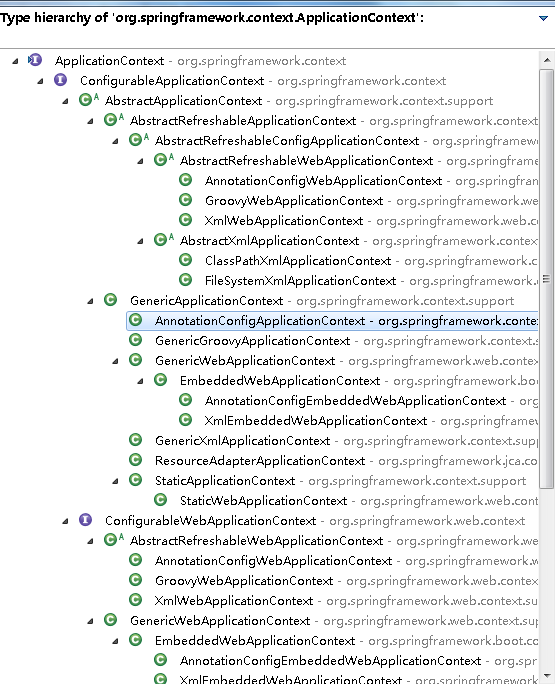

##spring	ApplicationContext

 
AnnotationConfigApplicationContext是ApplicationContext
的实现类之一，分支非常庞大，，， 

功能和FactioryBean相似，可以用来获取Bean对象等等；

###获取方式
SpringApplication.run(当前类.class, args); 

new AnnotationConfigApplicationContext(AppConfig.class,AppConfig2.class或xml等配置信息); 